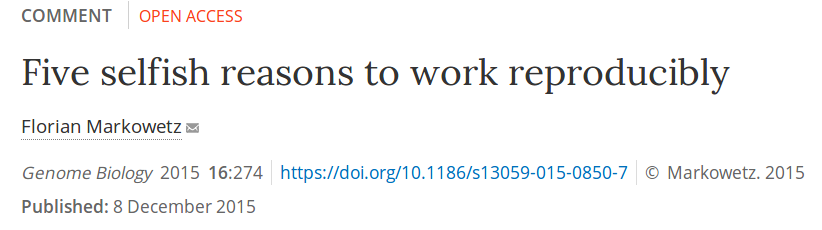

class: middle, center
background-image: url("img/slide1.jpg")
background-position: center
background-size: contain


---

```{r setup, include=FALSE}
options(htmltools.dir.version = FALSE)
```

class: middle
name: cc-by


### Links to the slides, code and blog post [bit.ly/2021-r-ms-research](http://bit.ly/2021-r-ms-research)

These slides and blog post are available under a **creative common
[CC-BY license](http://creativecommons.org/licenses/by/4.0/)**. You
are free to share (copy and redistribute the material in any medium or
format) and adapt (remix, transform, and build upon the material) for
any purpose, even commercially .


---
class: middle, inverse

## Acknowledgements: May Institute team


---
class: middle, inverse, center

## Motivating example

---
class: middle

**Inverse problems** are hard! (Example and figure borrowed from
[Stephen
Eglen](https://sje30.github.io/talks/2017/cam_eglen.html#inverse-problems-are-hard))


| Score (%) | grade |
|:---------:|:-----:|
| 70-100    |    A  |
| 60-69     |    B  |
| 50-59     |    C  |
| 40-49     |    D  |
| 0-39      |    F  |


- **Forward problem**: I scored 68, what was my grade?

- **Inverse problem**: I got a B, what was my score?

---
class: middle


## Research sharing: the inverse problem


---
class: middle

## Where is the scholarship?

> An article about computational science in a scientific publication
> is not the scholarship itself, it is merely advertising of the
> scholarship. The actual scholarship is the complete software
> development environment and that complete set of instructions that
> generated the figures.

[Buckheit and Donoho 1995, after Claerbout]


---
class: middle, inverse, center

## Why reproducibility is important

---
class: middle

For **scientific reasons**: think reproducibility crisis.

For **political reasons**: public trust in science, in data, in
experts; without (public) trust in science and research, there won't
be any funding anymore; lack of (public) trust in science leads to
poor public health decisions!

---
class: middle, inverse, center

## Reliable research

---
class: middle

## Reliable research

- It's not about reprodcible research.
- It's not about open research.
- It's about **reliable** research!


---
class: middle, inverse, center

## Is there a cost?

---
class: middle

- Yes?
- **No!** It is a matter or relocating time!

---
class: middle

## Does it take more time to work reproducibly?

**No**, it is a matter or relocating time!


From [Five things about open and reproducible science that every early
career researcher should know](https://osf.io/2jt9u/).


---
class: middle, inverse, center

## But what do we mean by reproducibility?

---
class: middle

**Repeat** my experiment i.e. obtain the same tables/graphs/results
using the same setup (data, software, ...) in the same lab or on the
same computer.


**Reproduce** an experiment (not mine) i.e. obtain the same
tables/graphs/results in a different lab or on a different computer,
using the same setup.


**Replicate** an experiment, i.e. obtain the same (similar enough)
tables/graphs/results in a different set up.


Finally, **re-use** the information/knowledge from one experiment to
run a different experiment with the aim to confirm results from
scratch.

---
class: middle

Another view (from a talk by [Kirstie
Whitaker](https://figshare.com/articles/Publishing_a_reproducible_paper/4720996/1)):

|                    | Same Data | Different Data |
|--------------------|-----------|----------------|
| **Same Code**      | reproduce | replicate      |
| **Different Code** | robust    | generalisable  |


---
class: middle

- Wheter you repeat, reproduce, replicate, validate, ... in my
  opinion, it all boils down to **understanding** what has been done
  and what is happening.


---
class: middle

- Wheter you repeat, reproduce, replicate, validate, ... in my
  opinion, it all boils down to **understanding** what has been done
  and what is happening.

- Here, I am not (that much) interested in blindly re-running
  something to confirm that I can the same results without
  understanding it... which in some cases can already be very
  challenging.

---
class: middle

- Wheter you repeat, reproduce, replicate, validate, ... in my
  opinion, it all boils down to **understanding** what has been done
  and what is happening.

- Here, I am not (that much) interested in blindly re-running
  something to confirm that I can the same results without
  understanding it... which in some cases can already be very
  challenging.

- Note that sometimes, things are expected not the reproduce.


---
class: middle, inverse, center

## Why reproducibility is important

(as an individual researcher)

---
class: middle

From

> Gabriel Becker [*An Imperfect Guide to Imperfect
> Reproducibility*](https://gmbecker.github.io/MayInstituteKeynote2019/outline.html)
> May Institute for Computational Proteomics, Boston, 2019.


## (Computational) Reproducibility Is Not The Point

But rather

## The goal is trust, verification and guarantees


---
class: middle

## The goal is trust, verification and guarantees

- **Trust in Reporting** - result is accurately reported
- **Trust in Implementation** - analysis code successfully implements
  chosen methods
- **Statistical Trust** - data and methods are (still) appropriate
- **Scientific Trust** - result convincingly supports claim(s) about
  underlying systems or truths

---
class: middle

Reproducibility As A Trust Scale (copyright Genentech Inc)


---
class: middle, inverse


Take-home messages

## Reproducibility isn't binary, it's a gradient, it's multidisciplinary, it's multidimensional.

and

## Reproducibility isn't easy.

---
class: middle, inverse, center


## More reasons to become a reproducible research practitioner

---
class: middle



> And so, my fellow scientists: ask not what you can do for
> reproducibility; ask what reproducibility can do for you! Here, I
> present five reasons why working reproducibly pays off in the long
> run and is in the self-interest of every ambitious, career-oriented
> scientist.

---
class: middle

## Five selfish reasons to work reproducibly

1. **reproducibility helps to avoid disaster**
2. **reproducibility makes it easier to write papers**
3. **reproducibility helps reviewers see it your way**
4. **reproducibility enables continuity of your work**
5. **reproducibility helps to build your reputation**


---
class: middle, center, inverse

## Tools for reproducible research

---
class: middle

- R/Bioconductor -- many of you are familiar or even expecrts with R.
- Writing R scripts (could also be Rmd files) to keep track of what we
  do, and be able to easily re-run the code.
- Package from the **R for Mass Spectrometry initiative**

It is also possible to set up complete pre-configured environments
(see for example Bioconductor's [Docker
containers](http://bioconductor.org/help/docker/) and
[AMIs](http://bioconductor.org/help/bioconductor-cloud-ami/) or the
[Renku](https://renkulab.io/) environment).

---
class: middle, center, inverse

## The [R for Mass Spectrometry](https://www.rformassspectrometry.org/) initiative


---
class: middle


- Project page:
  [https://www.rformassspectrometry.org/](https://www.rformassspectrometry.org/)
- Individual package pages
- Tutorial:
  [https://rformassspectrometry.github.io/docs/](https://rformassspectrometry.github.io/docs/)


.left-col-50[


]

.right-col-50[

The aim of the **R for Mass Spectrometry** initiative is to provide
efficient, thoroughly documented, tested and flexible R software for
the analysis and interpretation of high throughput mass spectrometry
assays, including proteomics and metabolomics experiments. The project
formalises the longtime collaborative development efforts of its core
members under the R for Mass Spectrometry organisation to facilitate
dissemination and accessibility of their work.

With **Sebastian Gibb** (University Medicine Greifswald, Germany) and
**Johannes Rainer** Eurac Research, Italy).

]


---
class: middle

## Mass spectrometry data ([Spectra](https://rformassspectrometry.github.io/Spectra/articles/Spectra.html) package)


These different parts can be stored in different modes, depending on the data *backend*.

(Figure from [Gatto *et al.* (2021)](https://pubs.acs.org/doi/10.1021/acs.jproteome.0c00313))


---
class: middle, center, inverse

## Live coding

---
class: middle, inverse

## Acknowledgements

- Johannes Rainer, Sebastian Gibb
- Users for feedaback and contributions

## Thank you for your attention!
